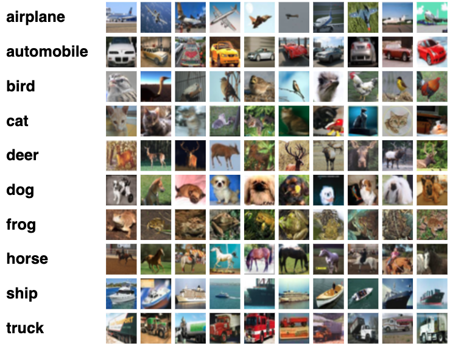
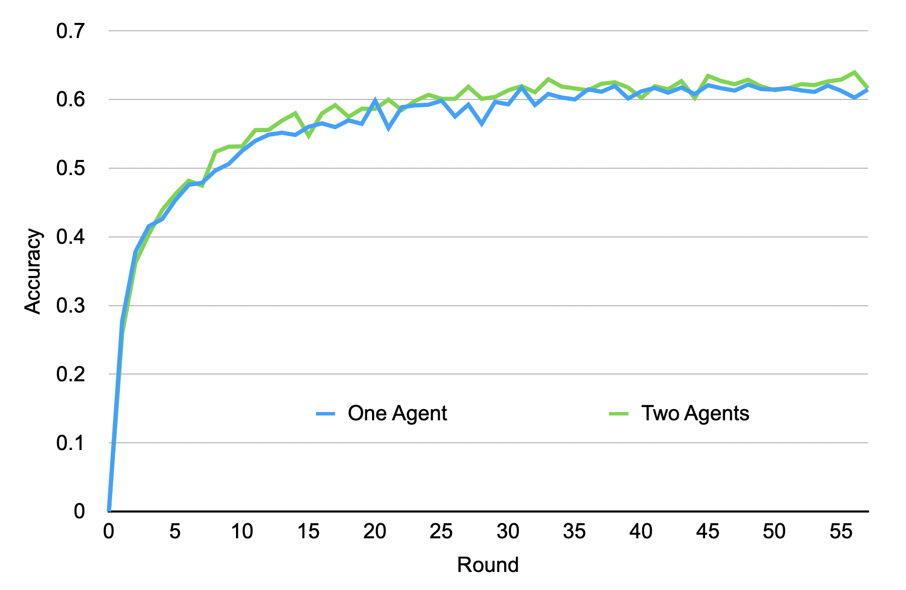

# Image Classification

This prototype demonstrates a usage of this Federated Learning framework for image classification tasks. We will use a famous image dataset ([CIFAR-10](https://www.cs.toronto.edu/~kriz/cifar.html)) to show how ML model grows through the FL process over time.

## CIFAR-10
- Dataset size: 60,000
  - Training data: 50,000
  - Test data: 10,000
- The Number of Classes: 10 (airplane, automobile, bird, cat, deer, dog, frog, horse, ship, truck)
  - Each class has 6,000 images
- Image: 32x32 Color




[This image is retrieved from [Krizhevsky's website](https://www.cs.toronto.edu/~kriz/cifar.html)]


## ML Model
Convolutional Neural Network
- Conv2D
- MaxPool2D (Maximum Pooling)
- Conv2D
- Fully Connected layer x 3


## How to Run

### Additional Installation
Please install torch and torchvision first after installing necessary libraries with `federatedenv`.
```
pip install torch
pip install torchvision
```


### Configuration file
You can configure many settings through the JSON config files in the setups folder. 
For more details, you can read the general description of the config files on our setups documentation.


### Execution 
This example assumes you are running two agents.
You can increase the number of agents running on the same device by specifying appropriate port numbers. Please see the README file for this platform.

```python
# FL server side
python -m fl_main.pseudodb.pseudo_db
python -m fl_main.aggregator.server_th

# First agent
python -m examples.image_classification.classification_engine 1 50001 a1
# Second agent
python -m examples.image_classification.classification_engine 1 50002 a2
```

### Additional Instruction
- To simulate the actual FL scenarios, the number of training data accessible from each agent can be limited to a specific number. 
- This should be specified with the variable ```num_training_data``` in ```classification_engine.py```. By default, it uses 8,000 images (2000 batches) for each round.


## Evaluation
- Performance Data
  - The performance data (accuracy of each local model and semi-global models) are stored on our database.
  - You can access to the corresponding ```.db``` file to see the performance history.
- Demo to show actual images
  - ```DataManager``` instance (defined in ```ic_training.py```) has a function to return one batch of images and their labels (```get_random_images```).
  - You can use this function to show the actual labels and the predicated labels by the trained CNN on specific images.

The following is a plot of the learning performance from our experimental runs.

